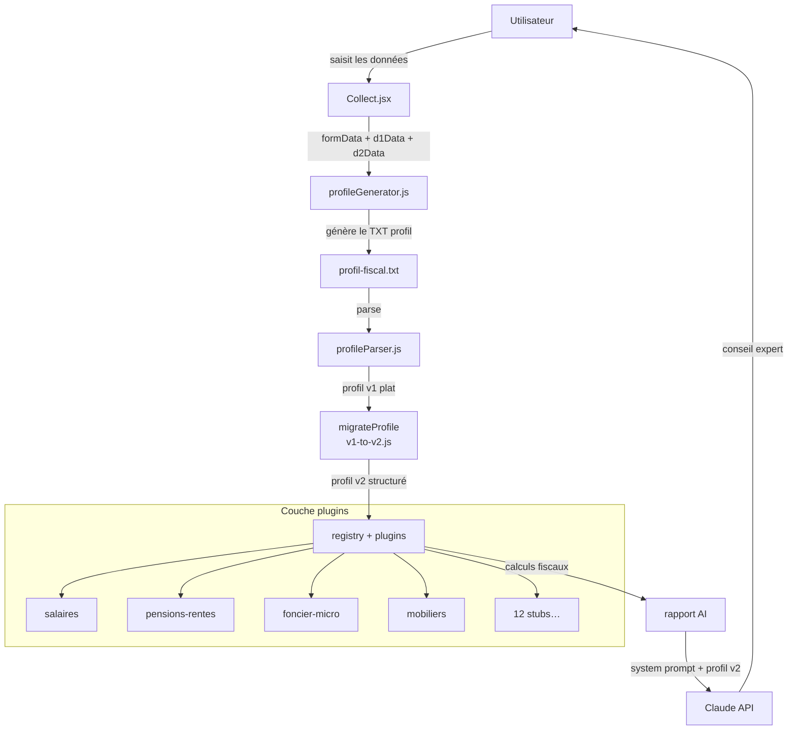
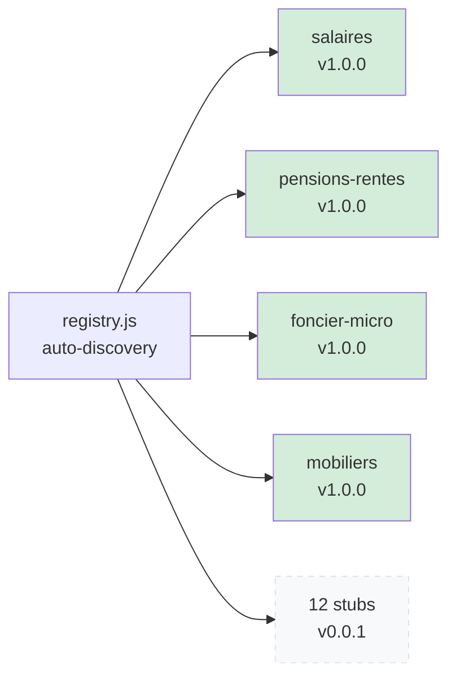
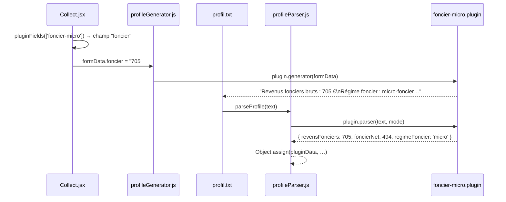

# Architecture — Kapio

> Document de référence pour les sprints futurs et les contributions IA.  
> Dernière mise à jour : Phase 3-C (refactoring parser/generator/Collect + plugin registry).

---

## Section 1 — Vue d'ensemble du flux de données

Kapio transforme des données brutes (formulaires, PDF) en conseil fiscal expert via un pipeline en cinq temps.



**Règle clé** : le fichier TXT est la source de vérité. Toute information passe par le TXT — aucune donnée ne transite directement du formulaire au calcul.

---

## Section 2 — Couche plugins

### Registre et plugins



Le registre utilise `import.meta.glob('./income/*.plugin.js', { eager: true })` : tout fichier `*.plugin.js` déposé dans `src/plugins/income/` est découvert et validé automatiquement, sans modifier `registry.js`.

### Cycle de vie d'un revenu (exemple : revenus fonciers)



### Contrat de l'interface `IncomePlugin`

Chaque plugin doit exporter un objet par défaut avec exactement ces 8 propriétés :

| Propriété | Type | Rôle |
|---|---|---|
| `id` | `string` (kebab-case) | Identifiant unique vérifié contre le registre à l'import. Toute collision lève une erreur. |
| `label` | `string` | Nom lisible affiché dans les logs et futurs écrans de gestion. |
| `version` | `string` (semver) | `1.0.0` pour les plugins actifs, `0.0.1` pour les stubs. Sert de marqueur de maturité. |
| `fields` | `FieldDescriptor[]` | Décrit les champs du formulaire que ce plugin gère : clé, libellé, type, caractère obligatoire, déclarant (D1/D2/foyer). `Collect.jsx` itère sur ces champs via `pluginFields()`. |
| `parser(text, mode)` | `Function → Object` | Lit le TXT profil et retourne un sous-objet partiel compatible v1 (noms camelCase). L'orchestrateur (`profileParser.js`) fusionne tous les résultats avec `Object.assign`. |
| `generator(formData, d1Data, d2Data, mode)` | `Function → string` | Produit le fragment TXT correspondant à ce type de revenu. Retourne `''` si aucune donnée pertinente. |
| `validator(formData)` | `Function → { valid, errors }` | Valide les données brutes du formulaire avant génération. |
| `calculator(v1)` | `Function → Object` | Calcule les grandeurs dérivées (abattements, prélèvements sociaux…) à partir du profil v1. Retourne un sous-objet fusionné dans le profil final. |
| `declarativeCases()` | `Function → CaseDescriptor[]` | Liste les cases fiscales 2042 gérées par ce plugin (ex. `1AJ`, `2TR`, `4BE`). Permet à `registry.getByType(caseCode)` de trouver le plugin responsable. |

---

## Section 3 — Schéma de données

### Du profil v1 (plat) au profil v2 (structuré)

Le profil **v1** est un objet plat : toutes les propriétés au même niveau, nommées en camelCase (héritage du parser historique). Le profil **v2** regroupe les données par domaine.

```
v2 = {
  $version: 2,                      // marqueur d'idempotence
  mode: "couple" | "solo",
  foyer: {
    statut: string,                  // "Pacsé(e)" tel que saisi
    statutNorm: string,              // normalisé : "pacse" | "marie" | …
    parts: number,                   // quotient familial
    departement: string,
  },
  declarants: [                      // 1 ou 2 selon mode
    {
      id: "D1" | "D2",
      salaires: { netImposable, brutImposable, pas, tauxPas },
      rni: number,                   // revenu net imposable après abattements
      pero: number,                  // plafond PER disponible
      age: number,
      typeRevenu: string,            // "Salarié(e)" | "Retraité(e)" | …
    }
  ],
  revenus: [                         // tableau normalisé de tous les revenus
    { id, type, declarant, montant, meta: {} }
  ],
  mobilier:  { case2TR, case2CK, case2BH },
  acomptes:  { irD1_8HW, irD2_8IW, psD1_8HX, psD2_8IX },
  foncier:   { brut, net, regime },
  calculs:   { rniFoyer, tmi, irBrut, irNet, totalDu, acomptes,
               creditsImpot, pasTotal, solde, rfr },
  patrimoine: { epargneD1: {…}, epargneD2: {…} },
}
```

### Règle de migration v1 → v2 : 5 transformations clés

1. **Normalisation du statut** : `"Pacsé(e)"` → `"pacse"` (supprime accents, minuscules, fuzzy match).
2. **Regroupement des déclarants** : les champs plats `salaireNetImposableD1` / `salaireNetImposableD2` deviennent un tableau `declarants`.
3. **Tableau `revenus` unifié** : chaque source de revenu (salaire, rente, foncier, mobilier…) devient un élément typé avec `{ id, type, declarant, montant, meta }`. Les IDs sont générés séquentiellement (`rev-1`, `rev-2`…).
4. **Regroupement des calculs** : les 10 champs fiscaux calculés sont regroupés sous `calculs`.
5. **Regroupement patrimonial** : les 16 champs d'épargne (`livretAD1`, `pelD2`…) sont regroupés sous `patrimoine.epargneD1` et `patrimoine.epargneD2`.

### Idempotence

`migrateProfile(v2)` retourne `v2` tel quel si `source.$version === 2`. Cela permet d'appeler le migrateur à tout moment sans vérifier le format de l'entrée — important pour les skills IA qui reçoivent un profil dont le format est inconnu.

---

## Section 4 — Modules principaux

### `profileParser.js`

Orchestrateur de parsing. Son rôle : lire le TXT profil et produire le profil v1 plat. `parseProfile()` fait moins de 30 lignes : elle délègue chaque domaine à une fonction privée (`_fiscal`, `_epargneDecl`, `_patrimoine`…) et chaque type de revenu aux plugins via `registry.getAll()`. **Ce module ne calcule rien** : les calculs sont dans les plugins et dans `taxCalculator.js`.

### `profileGenerator.js`

Transforme les données du formulaire en TXT profil. `buildProfile()` fait moins de 15 lignes : elle délègue au mode solo (`_buildSolo`) ou couple (`_buildCouple`). **Ce module ne valide pas** les données — la validation est dans les plugins.

### `registry.js`

Annuaire des plugins. Découverte automatique via `import.meta.glob`. Validation de l'interface à l'import (erreur immédiate si un champ obligatoire manque ou si un ID est en double). **Ce module ne stocke aucun état métier** — il ne connaît ni les valeurs du formulaire, ni le profil parsé.

### `Collect.jsx`

Formulaire de collecte. Génère les champs de revenus dynamiquement via `pluginFields(ids)`, qui lit `plugin.fields` et y fusionne les métadonnées UI (`INCOME_UI`). **Ce composant ne calcule rien et ne parse rien** — il produit uniquement les données brutes transmises à `profileGenerator`.

### `v1-to-v2.js` (migrateur)

Transforme un profil v1 plat (ou un TXT profil) en profil v2 structuré. Peut recevoir une string, un objet v1, ou un objet v2 (idempotent). **Ce module ne modifie pas le schéma v1** — il le lit en lecture seule et construit un v2 neuf.

### `profileParserUtils.js`

Helpers partagés de parsing bas niveau : `n()` (nombre entier), `f()` (nombre flottant), `s()` (chaîne), `oui()` (booléen), `signed()` (négatif possible), `section()` (extraction d'une section TXT). Importé à la fois par `profileParser.js` et par les plugins.

---

## Section 5 — Décisions techniques

### Pourquoi auto-discovery plutôt que registre manuel ?

Un registre manuel (`import plugin from './foncier-micro.plugin.js'; registry.register(plugin)`) crée une friction : ajouter un plugin impose de modifier deux fichiers. Avec `import.meta.glob`, déposer un fichier `*.plugin.js` dans `income/` suffit. La validation à l'import (`validatePlugin`) assure qu'un plugin malformé échoue immédiatement, pas silencieusement.

### Pourquoi JSON Schema Draft 2020-12 pour les types ?

Les types (`FieldDescriptor`, `IncomePlugin`, `CaseDescriptor`) sont documentés en JSDoc dans `types.js` sans dépendance externe. Cela donne l'autocomplétion IDE et la documentation sans alourdir le bundle. La validation à l'exécution est assurée par `validatePlugin()` dans le registre.

### Pourquoi un migrateur v1→v2 idempotent ?

Les skills IA (`masterPrompt.js`) reçoivent un profil dont ils ne contrôlent pas le format. L'idempotence (`if ($version === 2) return source`) permet à n'importe quel skill d'appeler `migrateProfile()` sans vérification préalable. Elle garantit aussi que les tests de migration peuvent enchaîner les appels sans effets de bord.

### Limites connues et pistes d'évolution

| Limite | Piste |
|---|---|
| 12 plugins stub (v0.0.1) sans implémentation | Implémenter par sprint : BIC/BNC, dividendes, plus-values, IFI en priorité |
| `profileParser.js` contient encore des helpers métier qui pourraient devenir des plugins | Extraire `_acomptes`, `_per`, `_fiscal` en plugins dédiés (Phase 4) |
| Pas de schéma JSON Schema v2 formel | Créer `src/lib/migrations/v2.schema.json` et valider à l'export |
| Le TXT profil n'a pas de versionning | Ajouter une ligne `Version profil : 4` parsée par le parser pour détecter les anciens formats |
